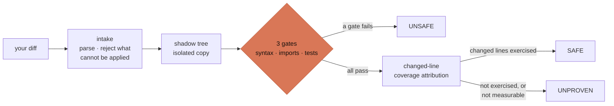
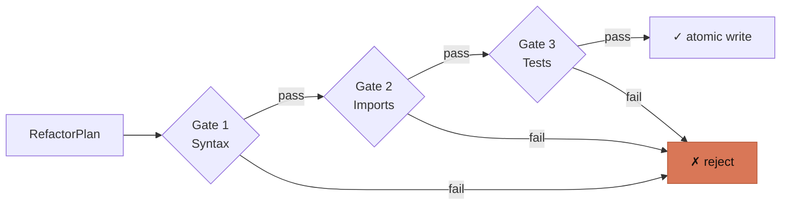

<p align="center">
  
</p>

# Refactron

[](https://github.com/Refactron-ai/refactron/actions/workflows/ci.yml)

**The verification layer for AI code change.** Prove that any change, your AI agent's, a codemod's, or your own, preserved behavior. Refactron applies the change in an isolated shadow tree, runs your real test suite, and returns a three-way verdict: `SAFE`, `UNSAFE`, or `UNPROVEN`. Your working tree is never touched.

It plugs in where change happens: a `verify-diff` CLI (and CI gate), and an MCP server your AI agent calls before it lands a change. No model decides whether your code is safe; the verdict is deterministic and reproducible.

**Jump to:** [Quickstart](#quickstart) · [The verdict](#the-verdict) · [MCP](#verify-from-your-agent-mcp) · [Architecture](#architecture) · [Docs](#docs)

---

## Quickstart

Requires Node.js ≥ 18, and Python 3.8+ with `coverage.py` for Python coverage.

```bash
npm install -g refactron
```

That puts two binaries on your `PATH`: `refactron` (the CLI) and `refactron-mcp` (the MCP server). To skip the install, run `npx refactron <command>` instead.

Authenticate once (`refactron login`, or `REFACTRON_TOKEN` in CI; unauthenticated exits `7`), then verify a diff:

```bash
git diff > change.diff        # or: your agent wrote change.diff
refactron verify-diff . --diff change.diff --test-cmd "python3 -m pytest -q"
```

```text
[UNPROVEN] Tests pass, but the changed code is not exercised by any test.
  uncovered: calc.py:14
```

Refactron copies the repo into an isolated shadow tree, applies the diff there, runs the gates, and measures whether your tests exercise the changed lines. Your real tree is never modified. Add `--json` for the full reproducible report.

### Installing from PyPI

`pip install refactron==0.3.0` installs a thin `refactron` shim that shells out to the npm CLI. It is not a Node-free path: you still need Node.js ≥ 18 **and** the npm package (`npm install -g refactron`). If the npm CLI is missing, the shim prints the exact matching install command and exits non-zero rather than installing anything for you. The shim provides the `refactron` command only; `refactron-mcp` comes from the npm package.

### Build from source (contributors)

```bash
git clone https://github.com/Refactron-ai/refactron
cd refactron
npm install
npm run build
```

The CLI is then `node dist/cli/index.js <command>` and the MCP server is `node dist/mcp/server.js`. Use the published binaries above unless you are working on Refactron itself.

---

## The verdict

| Verdict    | Meaning                                                                                              | Exit |
| ---------- | ---------------------------------------------------------------------------------------------------- | ---- |
| `SAFE`     | Every gate passed, your tests exercised every changed statement (none excluded), and the diff's author is trusted. | `0`  |
| `UNSAFE`   | A gate failed: the change broke something.                                                           | `1`  |
| `UNPROVEN` | Tests pass, but the changed code isn't exercised (or coverage couldn't be assessed).                 | `0`  |

`UNPROVEN` is the honest verdict. "Tests pass" is not "proven safe": if nothing runs the lines you changed, a green suite proves nothing about them. Refactron says so, and (for Python) names the line to add a test for.

By default the diff's author is **untrusted**, so a would-be-`SAFE` is withheld and returns `UNPROVEN`: coverage is measured by running the diff's own suite in-process, which an untrusted diff can forge. Pass `--trusted` (CLI) or `trusted: true` (MCP) only for a change whose author you already trust, never for an external or agent-authored diff.

Coverage is **Python-only** (via `coverage.py`), so a TypeScript or mixed-language diff can never earn `SAFE` today; it returns `UNPROVEN` ("coverage of the changed code could not be determined"). The gates still run; only the coverage half is Python-only.

---

## Verify from your agent (MCP)

Refactron ships a stdio [MCP](https://modelcontextprotocol.io) server exposing one tool, `verify_change`, so an AI agent can verify a change before it lands it. For Claude Code:

```bash
claude mcp add refactron -- refactron-mcp
```

`refactron-mcp` is installed by `npm install -g refactron`. Working from a source checkout instead? Point the client at `node /absolute/path/to/refactron/dist/mcp/server.js`.

The agent proposes an edit (full-file `edits` or a `unifiedDiff`), calls `verify_change`, and gets back the same `SAFE` / `UNSAFE` / `UNPROVEN` JSON report, then decides whether to land it. The tool runs entirely local and never mutates your repo.

---

## How it works

The verification engine is the shared core: an isolated shadow tree, three gates, and a coverage check.

| Piece             | What it is                                                                                                                                                                                |
| ----------------- | ----------------------------------------------------------------------------------------------------------------------------------------------------------------------------------------- |
| **Verifier**      | Three gates against a shadow tree: syntax → imports → tests, then changed-line coverage. Fuses into the `SAFE` / `UNSAFE` / `UNPROVEN` verdict. The core `verify-diff` and MCP both call. |

The engine surface is locked in `src/contracts.ts`. Language-specific work stays behind the per-language checks under `src/verify/checks/`, so adding a language does not mean forking the engine.

---

## Architecture

The pipeline a diff flows through. Nothing writes: the shadow tree is a copy, and the verdict is where it ends.



The three verification gates, in order:



Every change runs all three gates in order (syntax, then imports, then your full test suite); no gate is skipped. The test gate's default timeout is 600 seconds (10 minutes).

Full design: [`ARCHITECTURE.md`](./ARCHITECTURE.md). Vocabulary: [`GLOSSARY.md`](./GLOSSARY.md). ADRs: [`dev-docs/decisions/`](./dev-docs/decisions/).

---

## Configuration

`verify-diff` needs no configuration. The test command is auto-detected
(pytest / vitest / jest); override it with `--test-cmd` when the guess is wrong.

---

## Status & scope

`refactron@0.4.0` on npm ships one product from two entry points: the `refactron`
CLI and the `refactron-mcp` server.

**What it does:** verifies an arbitrary diff through three gates against an
isolated shadow tree (syntax → imports → tests), measures whether the tests
actually executed the changed lines, and fuses that into a `SAFE` / `UNSAFE` /
`UNPROVEN` verdict. Read-only: your working tree is never touched.

**Removed in 0.4.0:** migration mode, and with it the 20 AST transforms, the
`analyze` / `run` / `document` / `rollback` / `preflight` / `init` commands, the
Ink TUI, blast-radius scoring and the tier taxonomy. They were the demo of the
verification engine, not the product. The code is archived with its full history
and is not currently published; pin `refactron@0.3.1` if you depend on it.

**Deliberately not built:**

- **No model anywhere.** The verdict is deterministic and reproducible. The one LLM consumer that ever existed, the migration-mode documenter, left with migration mode.
- **No network calls** from the verification engine: it runs entirely local.
- **Coverage is Python-only** (via `coverage.py`), so a non-Python or mixed diff returns `UNPROVEN`, never a false `SAFE`.
- **No Ruby / Go / Rust checks yet**: syntax and imports are Python and TypeScript only; anything else returns `UNPROVEN` rather than a guess.

**Roadmap:** fleet verification across many repos and audit history are the paid tier; v1.0 lands once external usage has characterized the real bug surface.

---

## Docs

- [`ARCHITECTURE.md`](./ARCHITECTURE.md): engines, locked surfaces, pipeline, invariants
- [`GLOSSARY.md`](./GLOSSARY.md): verdict, gate, shadow tree, attribution, sidecar
- [`RUNBOOK.md`](./RUNBOOK.md): release, rollback, CVE response
- [`CLAUDE.md`](./CLAUDE.md): agent working rules + ops scaffolding
- [`CONTRIBUTING.md`](./CONTRIBUTING.md): development workflow
- [`docs/`](./docs/): full user docs (also at [docs.refactron.dev](https://docs.refactron.dev))

Security findings: do not open a public issue. Email `security@refactron.dev`.

---

## License

[Apache License 2.0](./LICENSE). See [`LICENSE`](./LICENSE) and [`NOTICE`](./NOTICE).
